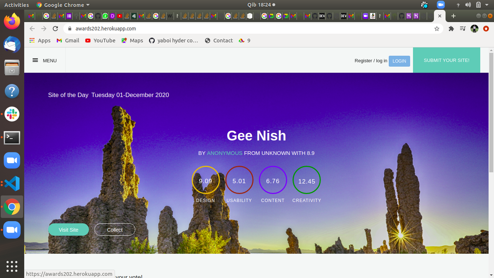

## AWARRDS
### Author
### Virginia Wairimu

### Description
This is an application that allows users to post a project he/she has created to get reviewed by other users.

### Preview


### known bug
no known bug incase you encounter one contact me at virgisonie20@gmail.com

## Setup

### Requirements
* Python3

### Cloning the repository
```bash
git clone https://github.com/Virginia202/week3Ip-Awards.git
```

### Creating a virtual environment

```bash
python3 -m virtualenv virtual
source virtual/bin/activate
```
### Installing dependencies
```bash
pip3 install -r requirements
```

### Prepare environmet variables
Create a .env file and add the following configutions to it
```python
SECRET_KEY= #secret key will be added by default
DEBUG= #set to false in production
DB_NAME= #database name
DB_USER= #database user
DB_PASSWORD=#database password
DB_HOST="127.0.0.1"
MODE= # dev or prod , set to prod during production
ALLOWED_HOSTS='.localhost', '.herokuapp.com', '.127.0.0.1'
```

### Database migrations

```bash
python manage.py migrate
```

### Running Tests
```bash
python manage.py test 
```

### Running the server 
```bash
python manage.py runserver
```

### Deploying to heroku

Set the configuration to production mode

### Technologies used
* `Python3.6.9`
* `Django3.0.7`
* `HTML`
* `CSS`
* `JAVASCRIPT`

### License
